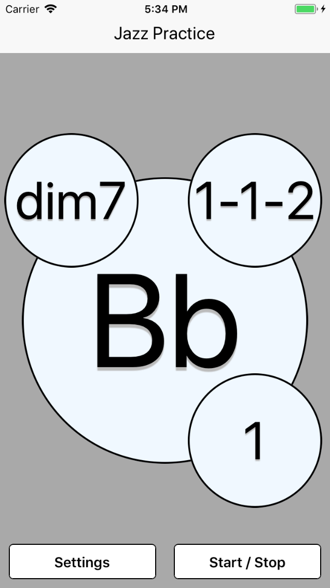
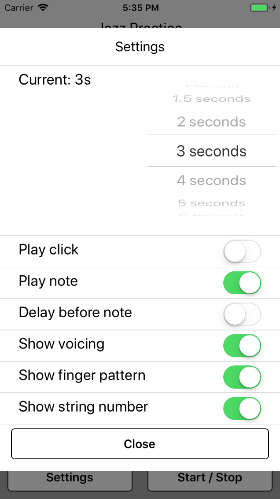

# Jazz Practice

This random key/voicing generator is intended to aid students of jazz in their learning. Displays a random note, chord voicing, string number, and finger pattern that the student should play within time increments of their choice.

# Screenshots

## License

You may not use this for commercial use or profit of any kind.

## Acknowledgments

- The components in the "common" folder were based on the ones taught in Stepher Grider's Udemy course on React.
